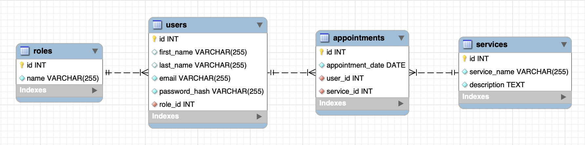

# 🏢 Tattoo Studio Appointment Management System

This project aims to develop the backend system for a tattoo studio appointment management system. The system allows users to register, log in, and access their personal area, where they can view and create appointments for various services offered by the studio.

  

## 🛠️ Services

The studio offers the following services:

- **Custom Tattoos**: Clients can select unique designs and motifs, personalizing their tattoo experience according to their preferences and tastes.
- **Catalog Tattoos**: The studio offers a variety of pre-designed tattoos from its catalog, allowing clients to choose from a range of stylized and proven options.
- **Tattoo Restoration and Rejuvenation**: The studio specializes in restoring and rejuvenating existing tattoos, working to improve and revitalize old tattoos.
- **Piercing and Dilator Placement**: The studio offers professional piercing and dilator placement services, guaranteeing safe procedures and varied styles to satisfy individual client preferences.
- **Piercing and Merchandise Sales**: In addition to its application services, the studio offers a selection of piercings and other body art-related products, allowing clients to purchase quality items to complement their unique style.

## ⚙️ Stack

  

## Local installation option

1. Clone the repository from the url
2. `$ npm install`
3. Connect the cloned repo with our Database
4. `$ Execute the migrations`
5. `$ Execute the seeders`
6. `$ npm run dev` to elevate our server

## Deploy 🚀

    <a href="https://tattooshop.zeabur.app"><strong> Tattoo Studio Deploy </strong></a>

## 🗄️ Database Schema

## 🌐 Endpoints

### 🔑 Authentication
| Method | URI                    | Action           | Permissions | Body                                            |
|--------|------------------------|------------------|-------------|-------------------------------------------------|
| POST   | /api/auth/register     | Register user    | Public      | `{ "user": "Name", "email": "yourmail@mail.com", "password": "123456789" }` |
| POST   | /api/auth/login        | Login user       | Public      | `{ "email": "yourmail@mail.com", "password": "123456789" }`                |

### 👥 Users
| Method | URI                               | Action              | Permissions | Body                                            |
|--------|-----------------------------------|---------------------|-------------|-------------------------------------------------|
| GET    | /api/users/all                    | View all users      | Superadmin  | N/A                                             |
| GET    | /api/users/profile                | View user profile   | User        | N/A                                             |
| PUT    | /api/users/profile/update         | Update user profile | User        | `{ "field_to_update": "newValue" }`             |
| DELETE | /api/users/:id                    | Delete user         | Superadmin  | N/A                                             |

### 📅 Appointments
| Method | URI                              | Action                | Permissions | Body                                            |
|--------|----------------------------------|-----------------------|-------------|-------------------------------------------------|
| POST   | /api/appointments/create         | Create appointment    | User        | `{ "appointment_date": "2024-07-10T15:30:00Z", "service_id": 2 }` |
| PUT    | /api/appointments/update         | Update my appointment | User        | `{ "id": appointmentId, "fieldToUpdate": "newValue" }` |
| GET    | /api/appointments/:id            | Retrieve appointment  | User        | N/A                                             |
| GET    | /api/appointments/scheduled      | View my appointments  | User        | N/A                                             |
| DELETE | /api/appointments/delete         | Delete appointment    | User        | `{ "id": appointmentId }`                       |

### 🛎️ Services
| Method | URI                        | Action            | Permissions | Body                                            |
|--------|----------------------------|-------------------|-------------|-------------------------------------------------|
| GET    | /api/services/all          | View all services | User        | N/A                                             |
| POST   | /api/services/create       | Create service    | Superadmin  | `{ "service_name": "ServiceA", "description": "example" }` |
| PUT    | /api/services/update/:id   | Update service    | Superadmin  | `{ "service_name": "ServiceB", "description": "example" }` |
| DELETE | /api/services/delete/:id   | Delete service    | Superadmin  | N/A                                             |

### 🛡️ Roles
| Method | URI                         | Action         | Permissions | Body                                            |
|--------|-----------------------------|----------------|-------------|-------------------------------------------------|
| GET    | /api/roles/all              | View all roles | Superadmin  | N/A                                             |
| POST   | /api/roles/create           | Create role    | Superadmin  | `{ "id": number, "name": "roleName" }`          |
| PUT    | /api/roles/update/:id       | Update role    | Superadmin  | `{ "field_to_update": "newValue" }`             |
| DELETE | /api/roles/delete/:id       | Delete role    | Superadmin  | N/A                                             |

## 📞 Contact

 
